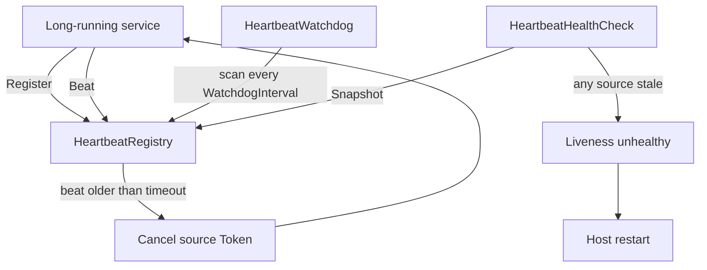

# AspNetCore.Extensions

A simple collection of opinionated configurations to bootstrap ASP.NET Core applications.

## Heartbeat

A liveness heartbeat registry, watchdog, and health check for detecting and aborting stalled long-running work in an ASP.NET Core host.

### Components

* [Heartbeat.cs](src/AspNetCore.MinimalApiExtensions/Services/Heartbeat/Heartbeat.cs): a disposable handle a service beats to signal progress and whose `Token` it links into cancellable work.
* [HeartbeatRegistry.cs](src/AspNetCore.MinimalApiExtensions/Services/Heartbeat/HeartbeatRegistry.cs): the thread-safe singleton that tracks named sources, cancels the stale ones, and disposes a source it replaces.
* [HeartbeatSnapshot.cs](src/AspNetCore.MinimalApiExtensions/Services/Heartbeat/HeartbeatSnapshot.cs): an immutable per-source view — last beat, monotonic age, and cancellation state — consumed by the health check.
* [HeartbeatScanOutcome.cs](src/AspNetCore.MinimalApiExtensions/Services/Heartbeat/HeartbeatScanOutcome.cs): the per-scan result carrying the cancelled sources and any whose cancellation threw.
* [HeartbeatWatchdog.cs](src/AspNetCore.MinimalApiExtensions/Services/Heartbeat/HeartbeatWatchdog.cs): the background service that cancels stale sources on a cadence it reloads when the interval changes.
* [HeartbeatHealthCheck.cs](src/AspNetCore.MinimalApiExtensions/Services/Heartbeat/HeartbeatHealthCheck.cs): the aggregate liveness check tagged `live`.
* [HeartbeatOptions.cs](src/AspNetCore.MinimalApiExtensions/Options/HeartbeatOptions.cs): the validated `DefaultTimeout` and `WatchdogInterval` configuration.

### Registration and usage

The pieces are registered together through `AddHeartbeat(...)` in [KritikosAspNetCoreDependencyInjectionsExtensions.cs](src/AspNetCore.MinimalApiExtensions/Extensions/KritikosAspNetCoreDependencyInjectionsExtensions.cs), which wires up the registry, its validated options, the watchdog hosted service, and the aggregate health check (tagged `live`).

A long-running service resolves `HeartbeatRegistry`, registers a named source, beats it as work progresses, links its `Token` into cancellable calls, and disposes it when the work ends.

```csharp
services.AddHeartbeat();

// HeartbeatRegistry is injected into the worker.
using var heartbeat = registry.Register("import", TimeSpan.FromSeconds(30));
while (moreWork)
{
  await StepAsync(heartbeat.Token);
  heartbeat.Beat();
}
```

### Configuration

`HeartbeatOptions` binds from the `AspNetCore:Heartbeat` configuration section and is validated on startup, so misconfiguration fails fast rather than surfacing as an opaque runtime error.

| Property | Default | Notes |
| --- | --- | --- |
| `DefaultTimeout` | 15 seconds | Staleness window for sources that register without their own. Must be greater than zero. |
| `WatchdogInterval` | 10 seconds | How often the watchdog scans for stale sources. Must be greater than zero, and changes apply live without a host restart. |

> [!NOTE]
> A source is detected as stale on the next scan after its timeout elapses, so worst-case cancellation latency is roughly `DefaultTimeout + WatchdogInterval`. Keep `WatchdogInterval` at or below the shortest timeout you care about.

### Lifecycle



### Behaviour and guarantees

The feature keeps a stalled worker from silently wedging the host, while never letting the liveness machinery itself bring the host down.

| Concern | How it is handled |
| --- | --- |
| A cancellation callback throws | Each source is cancelled inside its own `try`/`catch`; the failure is logged and the scan continues, so one misbehaving linked-token callback cannot fault the watchdog and trip the default [BackgroundServiceExceptionBehavior][background-service-exception], which would otherwise stop the host. |
| Misconfiguration | `DefaultTimeout` and `WatchdogInterval` are validated greater than zero and checked on startup, so a bad value fails fast with a clear message. |
| Slow or re-entrant callbacks | Staleness is decided under the per-source lock, but [CancellationTokenSource.Cancel][cts-cancel] runs outside it, so a slow callback cannot stall the scan and a re-entrant one cannot deadlock the non-reentrant lock. |
| Clock jumps | Staleness is measured with a monotonic timestamp, immune to NTP corrections, DST shifts, and VM pause and resume. |
| Re-registering a name | `Register` disposes the previous handle, so the replaced source's `CancellationTokenSource` is never orphaned. |
| Beating a cancelled source | `Beat` is a no-op once a source is cancelled or disposed, and the health check reports a cancelled source unhealthy, so a bitten source cannot look fresh. |
| Changing the scan cadence | The watchdog updates its `PeriodicTimer.Period` from `IOptionsMonitor` changes, so a new `WatchdogInterval` takes effect without a restart. |

> [!IMPORTANT]
> Ownership follows the handle. A service must dispose its `Heartbeat` when the work ends; a cancelled or undisposed source keeps the aggregate liveness check unhealthy until it is re-registered or disposed. Recovery after a bite is a re-register, for a fresh `Token`, not a beat.

> [!NOTE]
> A process with no registered sources is healthy, so the probe never restarts an idle-but-alive host.

### Timekeeping

Elapsed-time measurement and scan scheduling run on the same injected `TimeProvider`, so the staleness clock and the cadence clock never disagree.

Staleness uses the monotonic pair [TimeProvider.GetTimestamp()][timeprovider-gettimestamp] and [TimeProvider.GetElapsedTime(startingTimestamp)][timeprovider-getelapsedtime]: each beat is stored as a `long` timestamp, and both `Heartbeat.CancelIfStale` and `HeartbeatHealthCheck` judge staleness by the elapsed time since it. `GetUtcNow()` is kept only for the human-facing "last beat" value in the health data.

Scheduling uses [PeriodicTimer][periodic-timer] built as `new PeriodicTimer(WatchdogInterval, timeProvider)`, so the cadence flows through the same clock, and its `Period` is updated live when the option changes.

| Aspect | Mechanism |
| --- | --- |
| Staleness math | `GetTimestamp` and `GetElapsedTime`, monotonic |
| Human-facing value | `GetUtcNow`, for the last-beat display only |
| Scan cadence | `PeriodicTimer(interval, timeProvider)`, `Period` reloaded live |
| NTP, DST, VM pause | Do not affect staleness |
| Test control | `FakeTimeProvider.Advance`, or stub `GetTimestamp` and `TimestampFrequency` |

### Observability

The component emits metrics and traces through `System.Diagnostics` under the source name `Kritikos.AspNetCore.MinimalApiExtensions.Heartbeat`, so it adds no dependency. Wire that name into a collector such as OpenTelemetry with `AddMeter(...)` and `AddSource(...)`; with no listener attached the instruments are effectively free.

| Signal | Name | Description |
| --- | --- | --- |
| Metric | `heartbeat_sources_active` | Gauge of sources currently registered. |
| Metric | `heartbeat_sources_cancelled_total` | Counter of sources cancelled by the watchdog for going stale. |
| Metric | `heartbeat_cancellations_failed_total` | Counter of cancellations that threw from a linked-token callback. |
| Trace | `ScanHeartbeats` | Span per watchdog scan, tagged with `kritikos.heartbeat.cancelled_count` and `kritikos.heartbeat.failed_count`. |

[background-service-exception]: https://learn.microsoft.com/dotnet/api/microsoft.extensions.hosting.backgroundserviceexceptionbehavior
[periodic-timer]: https://learn.microsoft.com/dotnet/api/system.threading.periodictimer
[cts-cancel]: https://learn.microsoft.com/dotnet/api/system.threading.cancellationtokensource.cancel
[timeprovider-gettimestamp]: https://learn.microsoft.com/dotnet/api/system.timeprovider.gettimestamp
[timeprovider-getelapsedtime]: https://learn.microsoft.com/dotnet/api/system.timeprovider.getelapsedtime
