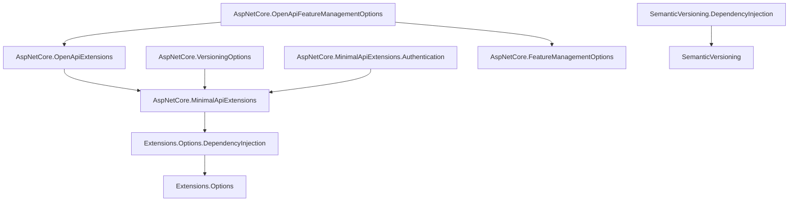

# AspNetCore.Extensions

A collection of small, single-purpose, opinionated libraries that bootstrap and harden ASP.NET Core applications and fill common gaps in the base class library.

Each library targets `net10.0`, is independently useful, and ships as a `Kritikos.<Project>` NuGet package built with the same governance (nullable, all analyzers, code style enforced at build, deterministic builds, SBOM, and SourceLink). Take only the pieces you need.

## Getting started

Install the package for the capability you want; every identifier is prefixed with `Kritikos.`:

```sh
dotnet add package Kritikos.AspNetCore.MinimalApiExtensions
```

> [!NOTE]
> Packages resolve from nuget.org and from the private `kritikos.io` feed configured in [nuget.config](nuget.config). The [PetStore.WebApi](samples/PetStore.WebApi) sample shows several of these libraries working together.

## Libraries at a glance

| Package | Summary |
| --- | --- |
| [Extensions.Options](src/Extensions.Options) | Static-abstract contracts that let an options class declare its own configuration section. |
| [Extensions.Options.DependencyInjection](src/Extensions.Options.DependencyInjection) | Binds and validates those options definitions and validates them on startup. |
| [AspNetCore.MinimalApiExtensions](src/AspNetCore.MinimalApiExtensions) | Startup, endpoint-mapping, correlation, [Heartbeat](#heartbeat) liveness, and periodic background-service building blocks for Minimal APIs. |
| [AspNetCore.MinimalApiExtensions.Authentication](src/AspNetCore.MinimalApiExtensions.Authentication) | Wires OAuth2 protected-resource metadata (RFC 9728) from the configured JWT bearer scheme's authority. |
| [AspNetCore.VersioningOptions](src/AspNetCore.VersioningOptions) | Opinionated defaults for `Asp.Versioning` API versioning and the API explorer. |
| [AspNetCore.FeatureManagementOptions](src/AspNetCore.FeatureManagementOptions) | Feature-flag endpoint filters and a session-backed feature manager for Minimal APIs. |
| [AspNetCore.OpenApiExtensions](src/AspNetCore.OpenApiExtensions) | OpenAPI transformers that publish a `bearer` (JWT) or `oauth2` security scheme and document auth responses/security for `[Authorize]` endpoints. |
| [AspNetCore.OpenApiFeatureManagementOptions](src/AspNetCore.OpenApiFeatureManagementOptions) | OpenAPI document transformer that hides operations behind disabled feature flags. |
| [HttpClient.Handlers](src/HttpClient.Handlers) | Delegating handler that injects a randomized `User-Agent` when one is absent. |
| [HttpClient.AuthenticationHandlers](src/HttpClient.AuthenticationHandlers) | Delegating handler that attaches an OAuth2 client-credentials bearer token, cached until near expiry. |
| [PagedResults](src/PagedResults) | Generic offset-pagination result types and EF Core query helpers. |
| [SemanticVersioning](src/SemanticVersioning) | SemVer 2.0.0 parsing and comparison records. |
| [SemanticVersioning.DependencyInjection](src/SemanticVersioning.DependencyInjection) | Registers a `SemanticVersionDescriptor` parsed from an assembly's informational version. |

### Dependency graph

Arrows point from a library to the in-repo library it depends on. `PagedResults`, `HttpClient.Handlers`, and `HttpClient.AuthenticationHandlers` have no in-repo dependencies and are omitted.



## Foundation

### Extensions.Options

Contracts that let an options class declare where it binds from, so the section location lives with the type instead of at every call site.

- Key types: `IOptionsDefinition` (`static abstract string Location`) and `INamedOptionsDefinition` (`static abstract Dictionary<string, string> NamedLocations`).
- Registration: none on its own — pair it with `Extensions.Options.DependencyInjection`.

```csharp
public sealed class WeatherOptions : IOptionsDefinition
{
  public static string Location => "Weather";

  public Uri Endpoint { get; set; } = new("https://example.invalid");
}
```

### Extensions.Options.DependencyInjection

Binds an `IOptionsDefinition` / `INamedOptionsDefinition` to configuration, applies DataAnnotations validation, and validates it on startup so misconfiguration fails fast.

- Registration: `services.AddOptionsDefinition<WeatherOptions>()`, or scan an assembly with `services.AddOptionsDefinitions(typeof(WeatherOptions).Assembly)` (use `AddNamedOptionsDefinitions` for `INamedOptionsDefinition`).
- Depends on: `Extensions.Options`.

```csharp
services.AddOptionsDefinition<WeatherOptions>();
```

## ASP.NET Core

### AspNetCore.MinimalApiExtensions

The core toolkit for Minimal-API hosts: correlation-header middleware, the [Heartbeat](#heartbeat) liveness subsystem, a periodic background-service base, endpoint-mapping contracts, and startup abstractions.

- Endpoints: implement `IEndpoint` and call `app.MapEndpoints()` to discover and register them.
- Correlation: `services.AddCorrelationHeader()` plus `app.UseCorrelationHeader()`; binds `AspNetCore:Middleware:Correlation` (`Header`, `IncludeInResponse`).
- Heartbeat: `services.AddHeartbeat()`; binds `AspNetCore:Heartbeat`. Detailed below.
- Periodic work: derive an options type from `PeriodicBackgroundServiceOptions` (`Interval`, `TriggerStopsCurrentExecution`) and register with `services.AddPeriodicBackgroundService<TService, TOptions>()`. The base requires a `TimeProvider` — registered as `TimeProvider.System` by that call and overridable — which a derived service accepts and forwards to `base` for testable timing.
- Startup: `IApplicationStartup` and `IWebApplicationStartup` compose registration and pipeline setup.
- Well-known endpoints: `services.AddSecurityTxt()` / `AddOAuthProtectedResource()` bind and validate options, and `app.MapSecurityTxt()` / `MapOAuthProtectedResource()` / `MapApiCatalog()` serve the [RFC 9116][security-txt], [RFC 9728][oauth-protected-resource], and [RFC 9727][api-catalog] documents at the origin-root `/.well-known/*`. Each returns a chainable builder, so `.RequireAuthorization(...)` gates it.
- Auto-discovery: `MapApiCatalog()` composes the catalog from every registered `IApiCatalogSource`, so libraries advertise APIs without manual registration (for example, `AspNetCore.VersioningOptions` contributes each API version's OpenAPI document); `MapOAuthProtectedResource()` falls back to the request's base URL when no `Resource` is configured.
- API-key auth: `AddAuthentication().AddApiKey()` registers the `ApiKey` scheme, reading a configurable header (`X-API-Key` by default) and resolving keys via an injected `IApiKeyValidator` (returns a `ClaimsPrincipal` or `null`); keyless requests are left unauthenticated so other schemes still run. Framework-only — no JWT dependency.
- Depends on: `Extensions.Options.DependencyInjection` and the ASP.NET Core shared framework.

#### Heartbeat

A liveness heartbeat registry, watchdog, and health check that detects and aborts stalled long-running work: a service registers a named `Heartbeat`, beats it as work progresses, and links its `Token` into cancellable calls. A background watchdog cancels any source whose beat goes stale, and an aggregate health check tagged `live` reports a stale source as unhealthy so the liveness probe restarts a wedged host; a process with no registered sources stays healthy.

```csharp
services.AddHeartbeat();

// HeartbeatRegistry is injected into the worker.
using var heartbeat = registry.Register("import", TimeSpan.FromSeconds(30));
while (moreWork)
{
  await StepAsync(heartbeat.Token);
  heartbeat.Beat();
}
```

`HeartbeatOptions` binds from `AspNetCore:Heartbeat` and is validated on startup.

| Property | Default | Notes |
| --- | --- | --- |
| `DefaultTimeout` | 15 seconds | Staleness window for sources that register without their own. Must be greater than zero. |
| `WatchdogInterval` | 10 seconds | How often the watchdog scans for stale sources. Must be greater than zero; changes apply live. |

Staleness is measured with a monotonic `TimeProvider` timestamp, so NTP corrections, DST shifts, and VM pause and resume never skew it. Each source is cancelled inside its own `try`/`catch`, so one faulting linked-token callback cannot fault the watchdog or bring down the host, and re-registering a name disposes the previous handle. Metrics and traces are emitted under the source name `Kritikos.AspNetCore.MinimalApiExtensions.Heartbeat` for wiring into OpenTelemetry.

### AspNetCore.MinimalApiExtensions.Authentication

`AddOidcProtectedResource()` registers [RFC 9728][oauth-protected-resource] OAuth2 protected-resource metadata and adds the configured JWT bearer scheme's authority to its authorization servers, so the metadata follows the API's authentication configuration instead of a hard-coded list. It layers JWT bearer awareness over the `MapOAuthProtectedResource()` well-known endpoint, kept in its own package so `AspNetCore.MinimalApiExtensions` stays free of the authentication dependency.

- Registration: `services.AddOidcProtectedResource()` (defaults to the `Bearer` authentication scheme; pass a scheme name to override), paired with `app.MapOAuthProtectedResource()` to serve the metadata.
- Depends on: `AspNetCore.MinimalApiExtensions` and `Microsoft.AspNetCore.Authentication.JwtBearer`.

### AspNetCore.VersioningOptions

Opinionated defaults for [Asp.Versioning][asp-versioning]: `ApiVersioningDefaultOptions` configures both `ApiVersioningOptions` and `ApiExplorerOptions` via `IConfigureOptions<T>`.

- Registration: `services.AddApiVersioningDefaults(builder => builder.HasApiVersion(new ApiVersion(1)).HasDeprecatedApiVersion(new ApiVersion(2)).ReportApiVersions())` builds and registers the shared `ApiVersionSet` and its `ApiVersionModel` as singletons. Endpoints implement `IVersionedEndpoint` (declaring a `Group` and `Version`); the default implementation resolves them from services, validates the version against the set, and applies `WithApiVersionSet`/`MapToApiVersion`, so implementations only map their routes.
- api-catalog: `AddApiVersioningDefaults()` also registers an `IApiCatalogSource` that advertises each discovered API version's OpenAPI document in the [RFC 9727][api-catalog] catalog; tune the document route with `ApiVersionCatalogOptions.DocumentRoutePattern` (default `openapi/{0}.json`). It stays inert unless `app.MapApiCatalog()` is mapped.
- Depends on: `AspNetCore.MinimalApiExtensions` and `Asp.Versioning.Mvc.ApiExplorer`.

### AspNetCore.FeatureManagementOptions

Gates Minimal-API endpoints on [Microsoft.FeatureManagement][feature-management] flags and adds a session-backed feature-state manager.

- Key types: `FeatureGateEndpointFilter` (`IEndpointFilter`), the `FeatureEndpointFilterExtensions` endpoint-filter helpers, `SessionFeatureManager` (`ISessionManager`), and the `RequirementType` enum (`All` / `Any`).
- Registration: `services.AddFeatureManagementSessionManager()`, then apply gates through the endpoint-filter extensions.
- Depends on: `Microsoft.FeatureManagement.AspNetCore`.

## OpenAPI

These packages extend the built-in `Microsoft.AspNetCore.OpenApi` pipeline; register the transformers on `OpenApiOptions` with `options.AddOperationTransformer<T>()` or `options.AddDocumentTransformer<T>()`.

### AspNetCore.OpenApiExtensions

Document transformers declare the security schemes the API validates and restore HTTP `QUERY` operations the built-in generator drops, and an operation transformer annotates the `[Authorize]` operations that require security:

- `BearerSecuritySchemeDocumentTransformer` publishes a bare HTTP `bearer` scheme (`bearerFormat: JWT`) under the key `bearer` — the pure JWT contract, when interactive login is not needed.
- `OAuth2SecuritySchemeDocumentTransformer` publishes an OAuth2 authorization-code scheme (inline authorization/token endpoints) under the key `oauth2` — the same bearer token, plus the interactive flow an API-reference UI (e.g. Scalar) needs to obtain it in one click.
- `ApiKeySecuritySchemeDocumentTransformer` publishes an API-key scheme (`in: header`) under the key `apiKey`, carrying the configured header name.
- `AuthorizationCheckOperationTransformer` adds `401`/`403` responses and, per operation, a security requirement referencing the scheme key mapped from that operation's required authentication scheme (from `[Authorize(AuthenticationSchemes = ...)]` or the endpoint's `AuthorizationPolicy`); operations that declare no explicit scheme fall back to a configurable default key (default `bearer`), and operations marked `[AllowAnonymous]` are left untouched. This lets a mixed API document some operations under `oauth2` and others under `apiKey`.
- `QueryOperationDocumentTransformer` re-injects HTTP `QUERY` operations ([RFC 10008](https://www.rfc-editor.org/info/rfc10008)) that the built-in generator drops — OpenAPI 3.1 has no `query` path-item field, so it emits the request schema but omits the operation. Each QUERY endpoint is restored with its request body, parameters, responses, and — when secured — `401`/`403` plus a security requirement (reusing the same scheme mapping as `AuthorizationCheckOperationTransformer`).

- Registration: `options.AddBearerSecurityScheme()`, `options.AddOAuth2SecurityScheme(authorizationUrl, tokenUrl, scopes)`, or `options.AddApiKeySecurityScheme(headerName)`, then `options.AddOperationTransformer(new AuthorizationCheckOperationTransformer(defaultSchemeId, schemesByAuthenticationScheme))`. Pass the default key (e.g. `OAuth2SecuritySchemeDocumentTransformer.SchemeId`) and, for multi-scheme APIs, a map from authentication scheme name to OpenAPI key (e.g. `{ [ApiKeyDefaults.AuthenticationScheme] = ApiKeySecuritySchemeDocumentTransformer.SchemeId }`). Add `options.AddQueryOperations(defaultSchemeId, schemesByAuthenticationScheme)` to restore `QUERY` operations, passing the same keys.
- Depends on: `AspNetCore.MinimalApiExtensions` and `Microsoft.AspNetCore.OpenApi`.

### AspNetCore.OpenApiFeatureManagementOptions

`FeatureFilterDocumentTransformer` (`IOpenApiDocumentTransformer`) removes operations whose feature gate is disabled from the generated document, so the published spec matches runtime behaviour.

- Depends on: `AspNetCore.FeatureManagementOptions` and `AspNetCore.OpenApiExtensions`.

## HTTP client

### HttpClient.Handlers

`UserAgentHandler` (`DelegatingHandler`) sets a randomized `User-Agent` — weighted by browser category — on any request that does not already carry one. The values come from `UserAgentProvider` / `IUserAgentProvider` and are configured through `UserAgentProviderOptions` (`Agents`, `BrowserWeights`).

- Registration: add it to a typed client with `AddHttpMessageHandler`.

### HttpClient.AuthenticationHandlers

`OpenIdConnectClientCredentialsHandler` (`DelegatingHandler`) attaches an OAuth2 [client-credentials][client-credentials] bearer token obtained by `OpenIdConnectTokenProvider`, which caches the token until shortly before it expires and coalesces concurrent refreshes into a single request to the identity provider.

- Configuration: `OpenIdConnectHandlerOptions` (`WellKnownEndpoint`, `ClientId`, `ClientSecret`); the provider also requires a `TimeProvider`.
- Depends on: `Microsoft.Extensions.Http` and `Microsoft.IdentityModel.Protocols.OpenIdConnect`.

> [!IMPORTANT]
> Register `OpenIdConnectTokenProvider` as a singleton so the token cache is shared across the pooled handler instances, and make sure a `TimeProvider` is registered (for example `services.TryAddSingleton(TimeProvider.System)`).

## General purpose

### PagedResults

Generic offset-pagination types — `PagedResult<T>` and the sealed `OffsetPagedResult<T>` — with `PagedResultExtensions` and `OffsetPagedResultExtensions` to materialize an EF Core `IQueryable` into a page plus total-count metadata.

- Depends on: `Microsoft.EntityFrameworkCore`.

### SemanticVersioning

[SemVer 2.0.0][semver] value types: the comparable `SemanticVersionDescriptor` record, `PreReleaseMetadataDescriptor`, `BuildMetadataDescriptor`, and `SemanticVersioningConstants` for parsing and ordering versions.

### SemanticVersioning.DependencyInjection

Registers a `SemanticVersionDescriptor` parsed from an assembly's `AssemblyInformationalVersionAttribute` so components can inject the running version.

- Registration: `services.AddSemanticVersionDescriptor(assembly)` or `services.AddSemanticVersionDescriptor(typeof(T))` (resolved from the type's assembly).
- Depends on: `SemanticVersioning`.

## Sample

The [PetStore.WebApi](samples/PetStore.WebApi) sample assembles the Minimal-API startup, versioning defaults, feature-gated endpoints, and the OpenAPI transformers (authorization, OIDC, and versioning) into one runnable API.

## Repository conventions

- All projects target `net10.0` with nullable reference types, the `All` analyzer mode, and code style enforced at build.
- Package versions are centrally managed in [Directory.Packages.props](Directory.Packages.props); builds are deterministic and produce lock files.
- Packaging prefers a project-local `README.md` and falls back to this file, so per-project READMEs are the preferred place for library-specific detail.

## License

Licensed under the terms of [LICENSE.md](LICENSE.md).

[asp-versioning]: https://github.com/dotnet/aspnet-api-versioning
[feature-management]: https://learn.microsoft.com/azure/azure-app-configuration/feature-management-dotnet-reference
[client-credentials]: https://datatracker.ietf.org/doc/html/rfc6749#section-4.4
[semver]: https://semver.org/spec/v2.0.0.html
[security-txt]: https://www.rfc-editor.org/rfc/rfc9116
[oauth-protected-resource]: https://www.rfc-editor.org/rfc/rfc9728
[api-catalog]: https://www.rfc-editor.org/rfc/rfc9727
